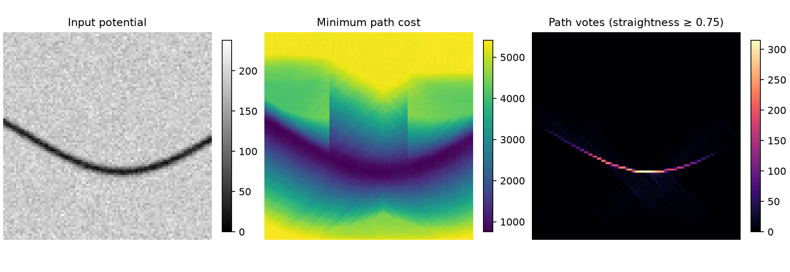

# Polygonal Path Image

[](https://github.com/lnajman/polygonal-path-image/actions/workflows/tests.yml)
[](https://github.com/lnajman/polygonal-path-image/actions/workflows/wheels.yml)

Find low-cost polygonal paths through grayscale images and turn them into path
voting maps. This Python/Cython package modernizes the implementation of the
Polygonal Path Image (PPI) method by Paula Agregán Reboredo, Vincent Bismuth,
and Laurent Najman.

The core returns a minimum-cost path from every pixel, constrained to one of four
cardinal cones. Lower pixel intensities are cheaper. Paths are useful for enhancing
dark curvilinear structures; voting highlights pixels visited by many paths.

Version 0.1.0 is an initial research release of the later four-cone student
implementation. It fixes a path reconstruction error in the historical source
and has deterministic correctness tests. Full-resolution checks on both supplied
example images preserve historical costs and validate every reconstructed path.
See the [validation report and scientific scope](docs/validation.md) for the
differences from the MICCAI method and the limits of these checks, and the
[migration notes](docs/migration.md) for API changes.

## Install

Requires Python 3.10 or later and NumPy 1.26 or later (including NumPy 2).
Prebuilt wheels for CPython 3.10–3.14 on Linux x86-64, Windows x86-64, and macOS
Intel/Apple Silicon are attached to [GitHub releases](https://github.com/lnajman/polygonal-path-image/releases).
Download the wheel matching your Python version and platform, then install its
local filename with `python -m pip install ./polygonal_path_image-....whl`.
See [supported platforms and release details](docs/releasing.md).

Installing from source also requires a C compiler: Xcode Command Line Tools on
macOS, GCC/Clang on Linux, or Microsoft C++ Build Tools on Windows. Pip installs
the Python build dependencies automatically in an isolated environment.

```sh
python -m pip install "git+https://github.com/lnajman/polygonal-path-image.git"
```

Or install a local checkout:

```sh
git clone https://github.com/lnajman/polygonal-path-image.git
cd polygonal-path-image
python -m pip install .
```

This project is not yet published on PyPI. NumPy is the only required runtime
dependency. Pillow and Matplotlib are optional, used by the example script.

## Use

```python
import numpy as np
from polygonal_path_image import compute_ppi, filter_tortuosity, voting

image = np.full((32, 48), 200, dtype=np.uint8)
image[16, :] = 10  # A dark horizontal structure.

costs, paths = compute_ppi(image, segment_length=2, nb_segments=5)
filtered_costs = filter_tortuosity(costs, paths, threshold=0.75)
votes, inverted_votes = voting(filtered_costs, paths)

# The start of this path is (16, 10); its subsequent endpoints are:
print(paths[16, 10])
print(costs[16, 10])
```

- Input: a nonempty 2D `numpy.ndarray` with dtype `uint8`. Convert other image
  types explicitly, without silently truncating floating-point intensities.
- `costs`: an `(H, W)` float64 array; `inf` means no path with the requested length fits.
- `paths`: an `(H, W, nb_segments, 2)` int64 array of endpoint `(row, column)`
  coordinates. The source pixel is implicit. Impossible paths contain only `-1`.
- A segment advances `segment_length` pixels along its cone's main axis.
  Costs exclude the source pixel, include every segment endpoint, and count joints once.
- Computation performs no file I/O or plotting and does not modify inputs.

Additional functions are `bresenham_line`, `orientation`, and `prune_paths`.
See the [API and algorithm conventions](docs/api.md).

## Reproducible example

```sh
python -m pip install '.[examples]'
python examples/synthetic_curve.py --output example-output
```

This generates its own synthetic image with a fixed random seed and saves a
comparison figure and NumPy arrays. No historical image files are required.
Use `--input path/to/image.png` to process a grayscale conversion of another image.



## Development

```sh
python -m pip install -e '.[dev,examples]'
python -m pytest
ruff check .
python -m build
python -m twine check dist/*
```

Tests enumerate all paths on small grids independently of the dynamic-programming
implementation. They check optimal costs, exact tie behavior, reconstructed path
costs, boundary conditions, invalid inputs, voting, tortuosity, orientation, and
pruning. CI builds a wheel from the source distribution and tests the installed
wheel on Linux, macOS, and Windows. NumPy 1.26 runtime compatibility is tested
separately from current NumPy 2.

Working memory grows with `H * W * (segment_length + nb_segments)`; the path array
alone uses `16 * H * W * nb_segments` bytes. Start with modest images and path
lengths. The pure Python postprocessing routines prioritize clarity and can cost
more time than the compiled core; pruning may compare many pairs of paths.

## Authors and citation

Package and original implementation authors: **Paula Agregán Reboredo**,
**Vincent Bismuth**, and **Laurent Najman**. Paula developed the work as a student;
Vincent and Laurent were her advisors and contributed to the code.
Maintainer: **Laurent Najman**.
See [AUTHORS.md](AUTHORS.md), [CITATION.cff](CITATION.cff), and
[research provenance](https://github.com/lnajman/polygonal-path-image/blob/main/research/README.md).

Original method: Vincent Bismuth, Régis Vaillant, Hugues Talbot, and Laurent Najman,
[*Curvilinear Structure Enhancement with the Polygonal Path Image - Application
to Guide-Wire Segmentation in X-Ray Fluoroscopy*](https://hal.science/hal-00741956v1/).
In *Medical Image Computing and Computer-Assisted Intervention – MICCAI 2012*,
Part II, Lecture Notes in Computer Science **7511**, pp. **9–16**, Springer, 2012.
DOI: [10.1007/978-3-642-33418-4_2](https://doi.org/10.1007/978-3-642-33418-4_2).

The maintained code is distributed under the [BSD-3-Clause license](LICENSE).
