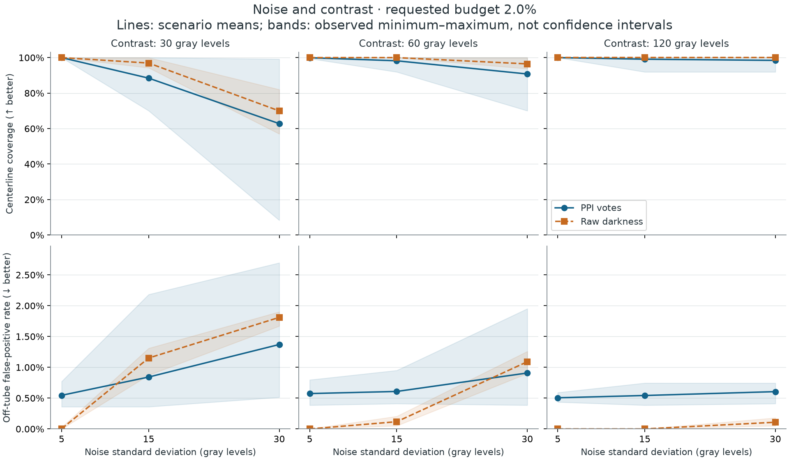
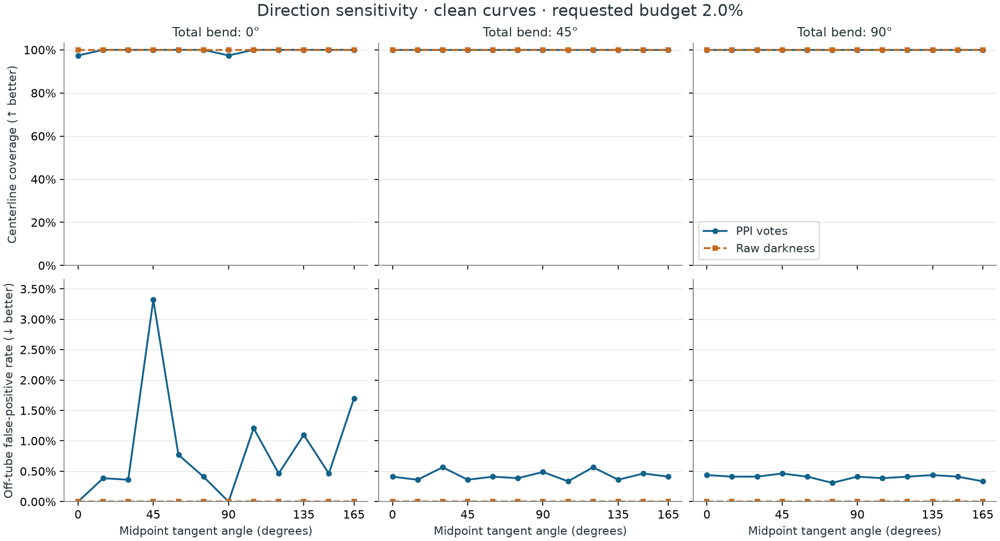
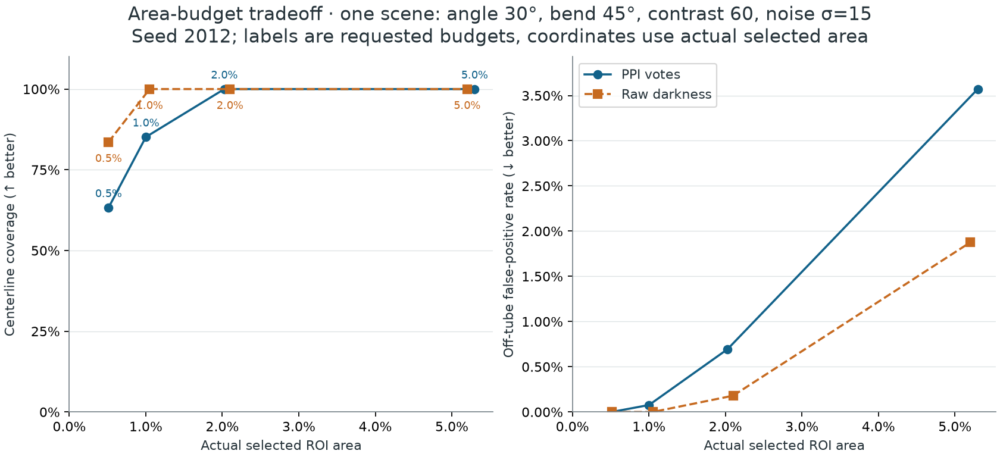
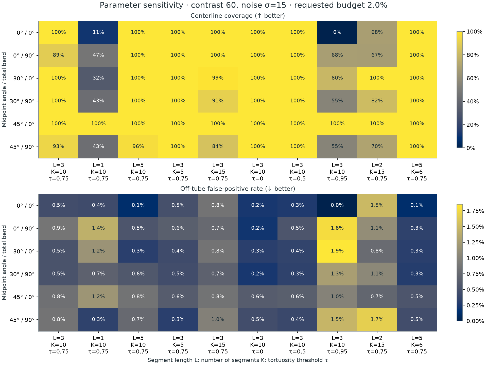
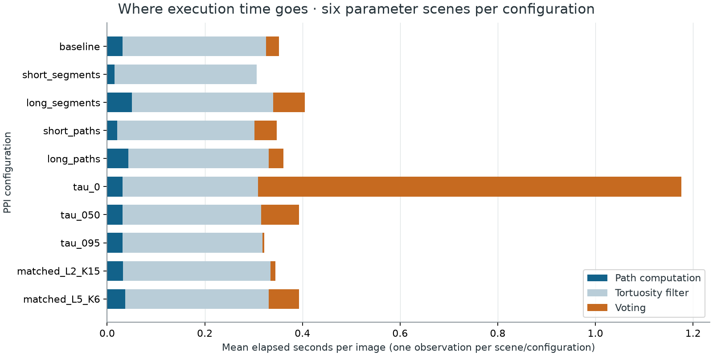

# Synthetic recovery benchmark

This benchmark measures how the released `0.1.0` implementation recovers known
synthetic curves. It adds task-level measurements to the exact numerical checks
in the [validation report](../validation.md). The inputs are generated Gaussian
tubes and Gaussian noise; these are targeted stress tests, not clinical images
or a reproduction of MICCAI 2012 accuracy.

The [executed notebook](../../examples/ppi_synthetic_benchmark.ipynb) shows the
images, metric definitions, parameter changes, and full-panel results. The
[complete JSON record](synthetic-v0.1.0.json) contains every measurement,
scenario, seed, timing observation, environment, and source hash.

## What this run shows

At the predefined **2% nominal pixel budget**, the baseline PPI settings do not
outperform raw image darkness across this panel of isolated synthetic tubes.
Across the 81 noisy scenarios, mean centerline coverage is **93.1% for PPI** and
**95.9% for darkness**; mean off-tube false-positive rates are **0.72%** and
**0.48%**, respectively. Mean actual selected areas are 2.11% and 2.07%. These
averages weight each specified scenario equally and do not estimate performance
on a population of clinical images.

The most difficult contrast/noise combination shows a tradeoff: PPI selects
fewer background pixels but misses more of the curve. Each row below averages
the same nine scenarios: three midpoint angles and three seeds, with a 45° bend.
Coverage and off-tube classification use a two-pixel tolerance.

| Contrast / noise SD | Method | Coverage | Off-tube false-positive rate | Actual selected area |
| --- | --- | ---: | ---: | ---: |
| 120 / 5 | PPI votes | 100.0% | 0.51% | 2.04% |
| 120 / 5 | Raw darkness | 100.0% | 0.00% | 2.04% |
| 60 / 15 | PPI votes | 98.2% | 0.61% | 2.06% |
| 60 / 15 | Raw darkness | 100.0% | 0.12% | 2.05% |
| 30 / 30 | PPI votes | 62.8% | 1.37% | 2.23% |
| 30 / 30 | Raw darkness | 70.0% | 1.81% | 2.11% |



Localization exposes the same tradeoff. At contrast 30 and noise SD 30, mean
prediction-to-centerline distance is 8.10 pixels for PPI and 13.65 pixels for
darkness, while mean centerline-to-prediction distance is 4.93 and 1.66 pixels.
These are means of the nine per-image means: PPI's selected pixels lie nearer
the curve on average, but leave larger gaps along it. Distances themselves are
untruncated; the two-pixel tolerance defines coverage and off-tube classification.

### Direction and ties

On clean curves, baseline PPI coverage ranges from 97.4% to 100%; darkness
coverage is 100% throughout. Coverage alone hides background votes. For the
straight 45° line, PPI selects 4.25% of the evaluation region at a nominal 2%
budget because an entire tied score block is included. Its off-tube false-positive
rate is 3.32%. The plots describe the combined effects of geometry, path selection,
filtering, and threshold ties; they do not isolate one cause of directional bias.



The four-budget view below uses one declared tutorial scene. Its horizontal
axis shows actual selected area, so tie effects are visible. It is a single-scene
ranking curve, not an aggregate detector accuracy curve.



### Parameter sensitivity and execution time

Across the same six parameter images, mean coverage is 97.0% at the baseline,
45.9% with `L=1, K=10, τ=0.75`, and 59.5% with `L=3, K=10, τ=0.95`. The strict
0.95 threshold retains no paths in one image. A zero false-positive rate with
no selections is therefore not evidence of successful detection. Thresholds
0 and 0.5 cover all six curves, but this small panel is insufficient to select
a general default.



The baseline pipeline averages 0.352 seconds per 128 × 128 image across these
six images: 0.032 seconds for path computation, 0.293 for filtering, and 0.026
for voting. With threshold zero, more paths reach voting and the mean pipeline
time rises to 1.176 seconds. This identifies filtering and voting as candidates
for profiling before attempting further core optimization. Values are single
observations per configuration/image on macOS arm64, Python 3.11.5, NumPy 2.4.6;
they are not a cross-platform performance comparison. The complete benchmark,
including generation and evaluation, took 100.3 seconds on this machine.



### No-target controls and next experiments

On the uniform blank image, darkness selects nothing; PPI selects 3.125% of the
evaluation region at the nominal 2% budget. On the nine noise-only images, PPI
selects 0.20%–3.15%. A relative rank cutoff cannot establish that a guidewire is
present. These controls motivate testing an absolute confidence or rejection
criterion on separate development and evaluation data.

The [Guide3D acquired-image pilot](guide3d/README.md) extends evaluation to
phantom images with overlapping structures and guidewire-only annotations.
Other visible lines are unclassified for general line enhancement, so
off-guidewire responses are not established false positives. The
[complete-reference multi-line study](multiline/README.md) measures every
generated line and uses development-frozen thresholds for absence controls.
Target-absent acquired-image controls remain future work. The historical MICCAI 2012 clinical
dataset was private and is unavailable for these studies. Neither
these results nor their comparison with a simple intensity baseline establish
MICCAI 2012 performance. Algorithm changes and new defaults should be assessed
on a separate evaluation set; this panel already informed these observations.

## Protocol fixed before the run

Every image is 128 × 128 `uint8` pixels. Evaluation uses its central 64 × 64
region. A straight line or circular arc has continuous arclength 48 pixels,
sampled at intervals no larger than 0.25 pixels and represented as a polyline.
The rotated curve's bounding box is centered on the image. The tangent angle
is measured at the arc midpoint, clockwise from increasing columns. Bend is
the arc's total signed turning angle.

The potential is `200 - contrast * exp(-distance**2 / (2 * 1.25**2))`, using exact
distance from pixel centers to the polyline's finite segments, including its
endcaps. Independent Gaussian intensity noise is added, then values are rounded
and clipped into `uint8`. Noise standard deviations therefore describe the
preclip signal. The entire reference and its two-pixel tolerance tube fit in
the evaluation region.

| Panel | Cases | PPI evaluations | Purpose |
| --- | ---: | ---: | --- |
| Direction | 12 angles × 3 bends = 36 | 36 | Noise-free geometry; angles 0°–165° in 15° steps, bends 0°/45°/90°, contrast 120 |
| Contrast and noise | 3 angles × 3 contrasts × 3 noise levels × 3 seeds = 81 | 81 | Angles 0°/30°/45°, bend 45°, contrasts 30/60/120, noise SD 5/15/30 |
| Parameters | 3 angles × 2 bends = 6 | 60 | Ten settings on the same six images; bends 0°/90°, contrast 60, noise SD 15, seed 2012 |
| No target | 1 blank + 3 noise levels × 3 seeds = 10 | 10 | Show behavior when no reference curve exists |
| Negative bends | 3 angles × 2 bends = 6 | 6 | Limited paired reflection check at bends −45°/−90°, contrast 60, noise SD 15, seed 2012 |
| Total | **139** | **193** | **1,328 rows** including both methods and four nominal budgets |

The robustness and noisy-control seeds are 2012, 2013, and 2014. These seeds are
paired across contrast and noise settings. Direction images are noise-free,
so duplicating them under different seeds would not add independent evidence.
The small negative-bend panel does not establish general reflection or rotation
invariance.

The baseline PPI configuration is `segment_length=3`, `nb_segments=10`, and
`tortuosity_threshold=0.75`. Each parameter-panel image also uses:

| Change | Settings |
| --- | --- |
| Segment length with ten segments | `L=1`, `L=5` |
| Number of segments with length three | `K=5`, `K=15` |
| Tortuosity threshold | `0`, `0.5`, `0.95` |
| Alternative subdivisions of 30 raster steps | `(L,K)=(2,15)` and `(5,6)`, alongside baseline `(3,10)` |

`L*K` is main-axis raster displacement, not a common Euclidean arclength.
Changing `L` at fixed `K` changes both segment granularity and total raster
length. Matching `L*K` helps compare subdivisions, but the number and size of
turns also affect the product-of-cosines filter. The 128-pixel canvas accommodates
the longest tested paths; it does not eliminate border influences from paths
originating outside the evaluation region. Finite and retained path fractions
are recorded for every PPI run.

## Selection and metrics

Path votes are compared with the simple baseline
`maximum(200 - image.astype(float), 0)`. Both methods are thresholded using the
same predefined nominal areas: **0.5%, 1%, 2%, and 5%** of the evaluation region.
The displayed primary comparison uses 2%; all other measurements remain in the
JSON. This is a ranking probe, not a fitted or clinically calibrated detector.

The rank cutoff is `ceil(fraction * 4096)`, applied to finite positive scores.
Every pixel tied at the boundary is included, so the **actual selected area may
exceed the nominal budget**. Zero scores are excluded. Actual area, cutoff,
positive-score count, and tie excess are recorded. Selecting an arbitrary subset
of tied pixels in row-major order would introduce a directional preference, so
the benchmark does not do that.

| Measurement | Definition |
| --- | --- |
| Centerline coverage | Arclength-weighted fraction of reference samples within 2 pixels of any selected pixel center. Uniform arclength samples have spacing ≤0.25 pixels and trapezoidal endpoint weights. |
| Selected-pixel precision | Fraction of selected pixel centers within 2 pixels of the finite reference polyline. |
| Off-tube false-positive rate | Selected pixel centers farther than 2 pixels from the reference, divided by **all** evaluation-region pixel centers farther than 2 pixels from it. |
| Prediction → centerline distance | Mean and 95th-percentile exact distance from selected pixel centers to polyline segments. |
| Centerline → prediction distance | Arclength-weighted mean and 95th-percentile distance from reference samples to selected pixel centers. |

Coverage and selected-pixel precision concern different populations; combining
them into an F1 score would be misleading. Both directions of localization
distance are reported because concentrated, accurate detections can still miss
part of the curve. The 95th percentile is the smallest observed distance
reaching 95% of the cumulative observation weight.

With a target but no selections, coverage is zero and localization distances
and precision are `null`. For negative controls, reference-dependent measures
are `null` by convention; all evaluation pixels are background, and selected
area equals the false-positive rate. This avoids an invented finite penalty
for missing predictions or a nonexistent reference. Ranges across the three
specified seeds describe observed spread, not confidence intervals.

## Reproduce

Use a repository checkout so the benchmark helpers and reference JSON are
available. The benchmark runner itself uses only the installed PPI package and
NumPy; Matplotlib is needed for its figures.

```sh
git clone https://github.com/lnajman/polygonal-path-image.git
cd polygonal-path-image
python -m pip install polygonal-path-image==0.1.0 matplotlib jupyterlab
python -m benchmarks.run_synthetic --output benchmark-output/results.json
python -m benchmarks.plot_synthetic --input benchmark-output/results.json
python -m jupyterlab examples/ppi_synthetic_benchmark.ipynb
```

The notebook recomputes a scene and a small parameter sweep, then visualizes
the committed full-panel results. It does not rerun all 193 PPI evaluations on
every execution. Change its result-file path to inspect a newly generated JSON.
Use `--suite smoke` for a quick runner check, and optionally
`--save-arrays benchmark-output/arrays` to retain the exact inputs and score maps.

Contributors who have a compiler can instead install the checkout and optional
tools with `python -m pip install -e '.[dev,benchmark,notebook]'`. The benchmark
helpers, notebook, and new extras live in this repository; they were added after
the PyPI `0.1.0` release.

Pipeline timings are single observations of `compute_ppi`, filtering, and voting.
They exclude input generation, geometry measurements, score thresholding,
imports, plotting, and file I/O. Identical core computations are cached between
threshold-only comparisons, with their original measured duration reused.
Recorded path-array bytes are an array size, not peak process memory. Timings
are descriptive observations on the recorded machine, not portable guarantees.

The generator, metric definitions, and matrix have independent tests; the
notebook is executed in CI. Numerical correctness of the package is tested
separately against exhaustive small-image oracles.
