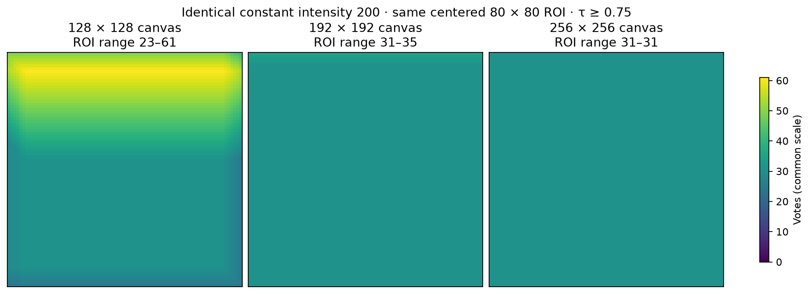
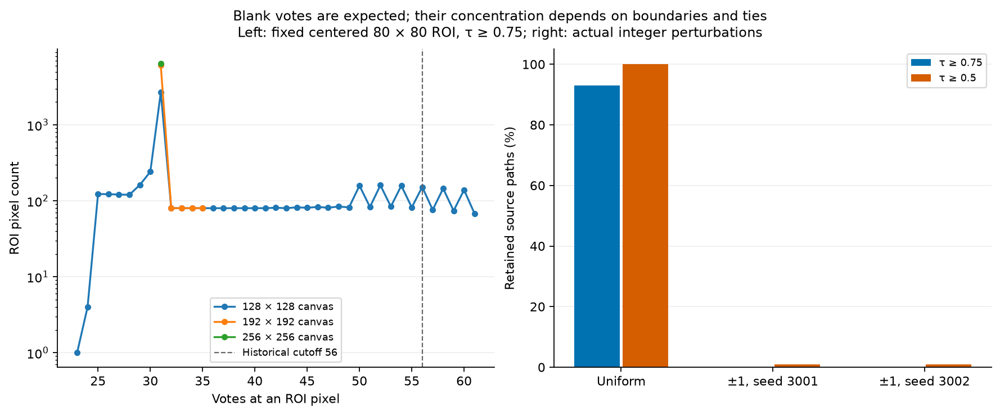
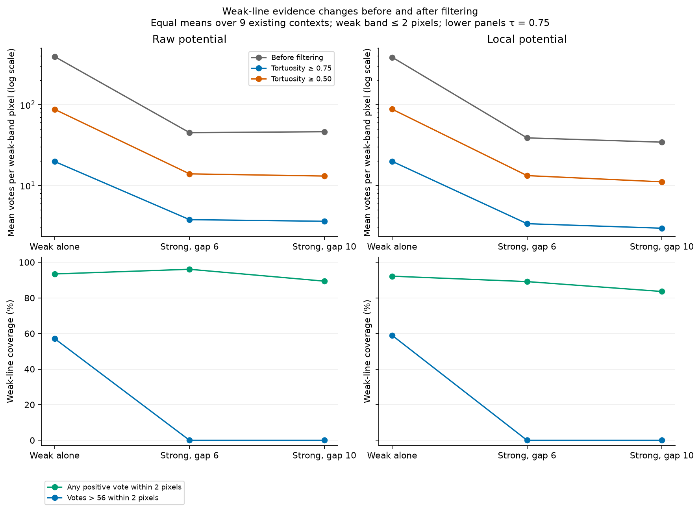
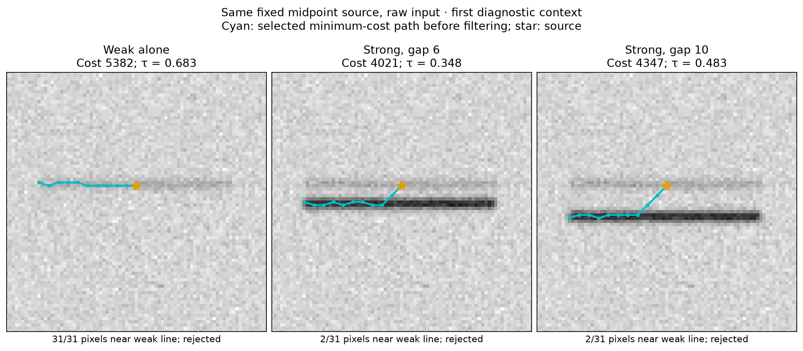
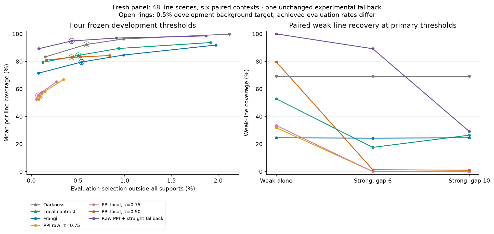

# Why weak lines lose votes, and why blank images still have paths

These diagnostics trace the released four-cone implementation through minimum
path selection, tortuosity filtering and voting. They follow the
[complete-reference multi-line study](../multiline/README.md) without changing
the package's computation or defaults. The
[executed notebook](../../../examples/ppi_path_diagnostics.ipynb) provides the
tables, figures and runnable analysis.

**A nonzero vote map on a blank image is expected.** All admissible fixed-length
paths have the same cost there, and the current algorithm selects one per
source. Voting records their occupancy; it is not inherently a confidence that
a visible line exists. The earlier blank selection statistic should be read in
that light. Finite boundaries and deterministic tie choices explain its uneven
spatial concentration.

**Weak-line loss starts before filtering.** When the strong neighbour is added,
the selected paths prefer the cheaper route through it. Tortuosity filtering
then removes many of these paths. There is no replacement search for a smoother
alternative. This reduces weak-line vote concentration, even though some nearby
votes remain. We found no cost reconstruction or vote-counting discrepancy.

## Blank images: equal-cost paths, nonzero occupancy

Every segment makes exactly three raster steps and there are ten segments.
On a constant potential `c`, each feasible path therefore costs **30c**.
Voting includes its source and counts shared joints once, so each retained
path contributes exactly **31 pixel visits**. These identities were verified
for every computed path/map in this experiment.

Uniform images at intensities 0, 100, 200 and 255 produce identical path
coordinates, retained-path masks and vote maps. The algorithm does not return
all tied optima: the last equal-cost endpoint wins within a cone, and the first
equal-cost cone wins in up/down/right/left order. Bounds and the fixed-length
cone constraints still limit which paths are admissible.

With intensity 200 and τ ≥ 0.75, keeping the same centered 80 × 80 evaluation
region while moving the image boundaries gives:

| Canvas | ROI boundary margin | ROI vote range | ROI pixels with votes > 56 |
| --- | ---: | ---: | ---: |
| 128 × 128 | 24 pixels | 23–61 | 502 / 6,400 (7.84%) |
| 192 × 192 | 56 pixels | 31–35 | 0 |
| 256 × 256 | 88 pixels | 31–31 | 0 |

The larger interior still has **31 votes everywhere**, not zero. What
disappears is the concentration above the preceding study's threshold. The
whole finite-canvas vote maps remain asymmetric; the large uniform interior
is symmetric. These observations describe the implemented deterministic tie
policy, not an enumeration or average over every admissible path.



Replacing intensity 200 by actual integer values 199/200/201, using independent
equiprobable draws with seeds 3001 and 3002, changes every selected source path.
At τ ≥ 0.75, the uniform image retains 15,232 of 16,384 paths; the perturbed
images retain only 5 and 4. At τ ≥ 0.50, those counts are 16,384 versus 155 and
147. Both perturbed images have zero ROI selections above the old cutoffs.
Integer perturbations change many ties but do not guarantee unique optima.
This is a sensitivity diagnostic, not a claim that adding noise improves an
image or that the cutoffs are calibrated confidence measures.



The full [blank record](blank-paths.json) contains eight core cases and twenty
vote maps, cost/feasibility checks, vote conservation, source-direction
histograms, flip/rotation comparisons, exact hashes and runtime provenance.

## Weak lines: attraction first, rejection second

We revisit all nine existing weak-line contexts: weak alone, strong neighbour
6 pixels away, and strong neighbour 10 pixels away, each on raw and local
potentials. This is explanatory reuse of an already inspected panel, not a
fresh performance claim. Weak geometry, noise and the original uint8 image
pixels within two pixels of the weak reference remain identical within each
triplet. This is before preprocessing: Gaussian local-contrast preprocessing
can change the weak-band potential when the neighbour is added.

For both potentials and both neighbour separations, **all 2,130 source pixels
within two pixels of the weak line, pooled across the nine contexts,** produce
a selected path that visits the
strong line's 3σ support. None of those paths stays entirely in the weak band.
With the weak line alone, 73.1% (raw) and 72.4% (local) stay within that band.
This identifies an effect of the minimum-cost path objective before any
tortuosity rejection or thresholding occurs.

The table gives equal-context means for the raw potential:

| Quantity | Weak alone | Neighbour, gap 6 | Neighbour, gap 10 |
| --- | ---: | ---: | ---: |
| Mean weak-band votes before filtering | 392.44 | 45.04 | 46.25 |
| Mean weak-band votes after τ ≥ 0.75 | 19.78 | 3.77 | 3.60 |
| Weak coverage with votes > 56, before filtering | 100.0% | 68.2% | 76.4% |
| Weak coverage with votes > 56, after τ ≥ 0.75 | 57.1% | 0.0% | 0.0% |
| Weak coverage with any positive vote, after τ ≥ 0.75 | 93.5% | 96.1% | 89.4% |

Coverage asks whether selected pixel centers lie within two pixels of the
reference; it is not the fraction of reference pixels with nonzero votes.
The JSON separately records nearest-reference-pixel zero-vote arclength.
Unfiltered cutoffs are fixed-score diagnostics, **not newly calibrated error
rates**: removing filtering also changes the background response.



The source partitions account for votes from **every origin**, not just origins
near the weak line. They divide sources by weak-band membership and whether
their paths visit the strong tube; the four contributions reconcile exactly
to each whole vote map. The released voting function gives each accepted path
the same weight and ignores finite cost magnitude.



The fixed first-context midpoint example illustrates the mechanism. Its raw
weak-alone path costs 5,382, keeps all 31 raster pixels in the weak band and
has tortuosity 0.683. With the 6-pixel neighbour it costs 4,021, includes only
2 weak-band pixels and 29 strong-support pixels, and has tortuosity 0.348.
Both are rejected at τ = 0.75; the paired path is also rejected at τ = 0.50.
They are the actual minima returned from identical source coordinates, not
hand-selected alternative paths.

The [weak-path record](weak-paths.json) contains 54 case/potential combinations,
three stages each, bounded source examples and per-stage distributions. Checks
reproduce all **884,736 path costs**, **162 vote maps**, and source-partition
sums. Eighty-one score hashes agree bit-for-bit with the historical multi-line
study's matching pipeline settings. No package implementation was modified.

## A limited replacement experiment

The diagnosed filter discards the selected winner without returning to the
search for another admissible path. We therefore test one research-only
alternative: preserve every accepted original path; for rejected sources,
choose the cheapest candidate that repeats one existing segment displacement
for all ten segments. This gives 24 distinct directions with the same input,
segment length, path length and raster cost. All these alternatives are
straight. The first minimum wins ties in existing endpoint order; sources
without a feasible alternative remain inactive.

This **straight-candidate fallback** is not the globally cheapest path subject
to a tortuosity constraint. It changes the candidate selection rule and favours
straight structures. It neither weights votes nor suppresses blank votes.
It lives under `benchmarks/straight_fallback.py`, outside the public package.
Preservation of accepted winners, exhaustive small-grid candidate minima,
reconstructed costs and impossible-source handling are tested independently.

### Fresh evaluation, with the candidate and thresholds frozen

The [panel plan](fallback-plan.json) was saved before inspecting candidate
scores on fresh images. The candidate and each method's thresholds were then
fixed using the original 21 development images. The fresh panel contains
**48 line scenes and five blank/noise controls**: angles 19°, 53° and 107°,
seeds 4101 and 4102, with noise levels 5 and 12 assigned by the declared parity
rule. Eight scene variants share each of the six contexts. Only two underlying
Gaussian noise draws are used, with reuse across angles and scaling; these
are paired synthetic observations, not 48 independent samples. The uniform
blank is intentionally identical to the development blank and serves as a
functional control, not a fresh independent observation.

The [frozen protocol](fallback-protocol.json) and
[complete measurements](fallback-validation.json) record all seven methods,
four development background targets (0.1%, 0.5%, 1% and 2%), and a secondary
2% selected-area budget. No candidate or threshold was retuned on this panel.
At the primary **0.5% development background target**, fresh line-scene means
are:

| Method | Mean line coverage | Mean worst-line coverage | Outside-support selection | Centerline precision | Mean longest gap |
| --- | ---: | ---: | ---: | ---: | ---: |
| Darkness | 92.32% | 88.48% | 0.591% | 85.44% | 2.02 px |
| Local contrast | 84.35% | 74.60% | 0.504% | 86.25% | 6.35 px |
| Frangi | 79.55% | 67.33% | 0.538% | 80.76% | 7.90 px |
| Raw PPI, τ ≥ 0.75 | 54.78% | 34.06% | 0.097% | 92.92% | 22.30 px |
| Local PPI, τ ≥ 0.75 | 55.28% | 31.60% | 0.075% | 94.59% | 22.32 px |
| Local PPI, τ ≥ 0.50 | 82.91% | 66.31% | 0.431% | 81.96% | 9.13 px |
| Raw PPI + straight fallback | 94.88% | 89.74% | 0.433% | 67.37% | 1.98 px |

Coverage and centerline precision use the same 2-pixel tolerance as the earlier
study; background means pixels outside **all** rendered 3σ line supports.
These supports can be wider than the centerline tolerance. Worst-line coverage
is first the minimum over lines within each scene, then averaged over scenes.
Longest gaps are averaged over lines and then scenes. Controls are reported
separately. Actual evaluation background rates differ, so the table is not
a comparison at identical achieved error rates. Precision is undefined for an
empty selection: its means use 45/48 scenes for raw default PPI, 46/48 for
local default PPI and Frangi, and 48/48 for the other methods. Coverage, area
and background-rate means include all 48 line scenes.



The candidate recovers 100% of the weak line alone, **89.20%** beside the
6-pixel neighbour, and **29.10%** beside the 10-pixel neighbour, as equal means
over the six fresh contexts. Raw default PPI recovers 31.87%, 0% and 0%,
respectively. The fallback therefore addresses part of the diagnosed loss,
but the wider-separation failure remains. Darkness recovers 69.29% in all
three cases, showing that this candidate does not uniformly improve even
on the simplest baseline. On the other synthetic families, candidate coverage
is 100% for crossings, branches and the tested curved pairs, 99.89% for
parallel lines and 99.97% for mixed widths. These limited curves do not
establish performance on arbitrary curved structures.

The extra coverage also comes with broader selections. The candidate selects
8.34% of the ROI on average versus 0.97% for raw default PPI, and its
centerline precision falls from 92.92% to 67.37%. A pixel can be inside a
rendered line's support yet outside the centerline tolerance, so high support
precision would conceal this loss of localization.

The predefined **2% selected-area comparison** makes that tradeoff clearer:

| Metric at nominal 2% area | Raw PPI, τ ≥ 0.75 | Raw PPI + straight fallback |
| --- | ---: | ---: |
| Actual selected area (ties retained) | 2.084% | 2.019% |
| Mean line coverage | 79.84% | 76.62% |
| Mean worst-line coverage | 57.81% | 56.58% |
| Centerline precision | 71.79% | 97.60% |
| Outside-support selection | 0.5574% | 0.0050% |
| Weak alone coverage | 97.41% | 99.19% |
| Weak coverage, gap 6 | 7.00% | 0.00% |
| Weak coverage, gap 10 | 7.19% | 0.00% |

At this approximately matched area, the fallback concentrates its strongest
scores more precisely near lines, but **does not improve coverage or recover
the paired weak line**. Its fixed-threshold recovery gain therefore does not
establish better weak-line ranking under a small area budget. The budget keeps
all ties at the boundary score and selects only positive scores; it is not an
exact pixel-count constraint or a line-presence test.

On noise-only controls, the candidate selects 81, 81, 68 and 66 of 6,400
pixels (**1.03–1.27%**), whereas raw default PPI selects none. On the uniform
blank, the candidate still produces **25–70 votes per ROI pixel** and
507,904 votes across the full image. Its zero selected ROI pixels result
from the separately calibrated cutoff **113**, not disappearance of paths
or a blank-image detector. Raw PPI retains its cutoff 56 and 502 blank ROI
selections. A blank's vote magnitude alone is not evidence of line content.

The results justify keeping this as a **research candidate**, with the
released algorithm and defaults unchanged. A next algorithmic study should
address admissible alternative paths that remain near weak structures while
controlling localization and noise response. It needs a newly reserved panel;
the present fresh panel has now been inspected.

Integrity checks verified 2,590 unique measurement rows, 518 score hashes and
74 cache archives. All 735 development rows and 28 frozen threshold records
were unchanged between calibration and evaluation. Historical benchmark
sources and package computation were preserved.

## Reproduce

From a repository checkout:

```sh
python -m pip install -e '.[study,notebook,test]'
python -m benchmarks.diagnose_weak_paths \
  --output benchmark-output/weak-paths.json
python -m benchmarks.diagnose_blank_paths \
  --output benchmark-output/blank-paths.json \
  --cache-dir benchmark-output/blank-cache
python -m benchmarks.run_fallback_validation \
  --plan docs/benchmarks/diagnostics/fallback-plan.json \
  --work-dir benchmark-output/fallback-work \
  --output benchmark-output/fallback-validation.json \
  --phase all --workers 4
python -m benchmarks.plot_path_diagnostics \
  --directory benchmark-output --blank-cache benchmark-output/blank-cache
python -m jupyterlab examples/ppi_path_diagnostics.ipynb
```

The notebook reads the committed records; the commands above regenerate them
in a separate output directory. `--context-limit 1` bounds the weak-path
diagnosis for a smoke run. Reference sources, library/runtime information and
compiled-kernel hashes are recorded with the measurements. Costs, vote maps,
source partitions and source immutability are checked before final records
are written. Timings are observations, not controlled performance comparisons.

These experiments address the later four-cone implementation. The original
[MICCAI 2012 paper](https://hal.science/hal-00741956v1/) also distinguishes the
path image from subsequent unweighted/weighted voting and path filtering.
Reweighting an already diverted path changes its contribution, not its geometry;
it does not by itself restore a discarded weak-line alternative. None of the
experiments here is an exact reproduction of the original private clinical
evaluation.
