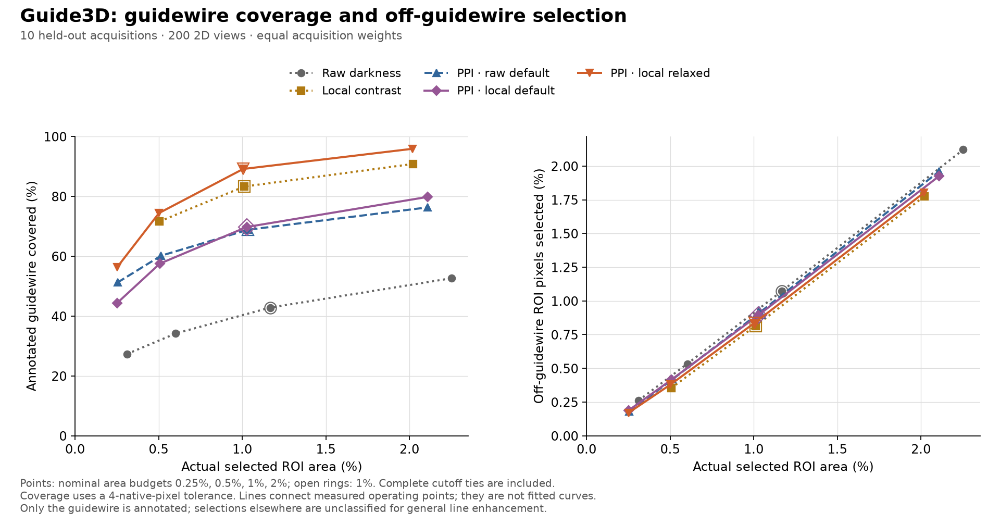
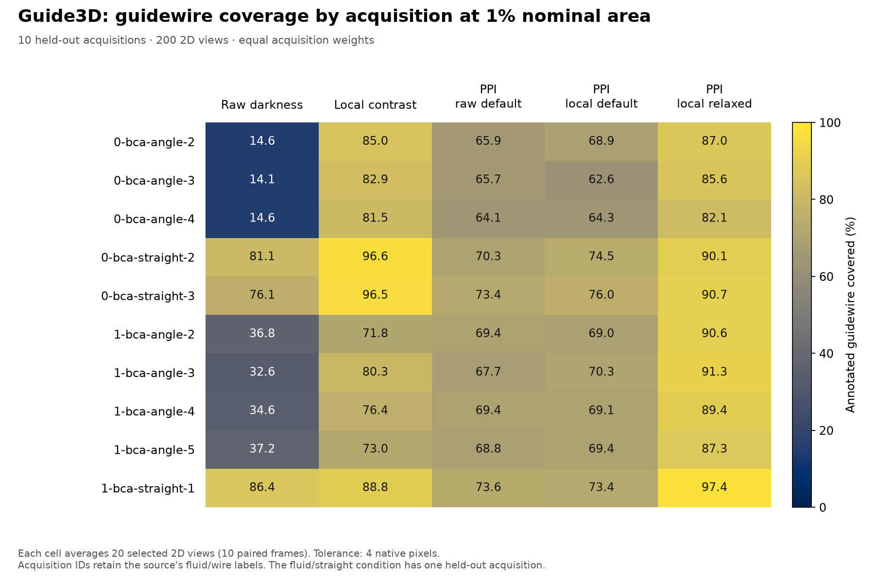
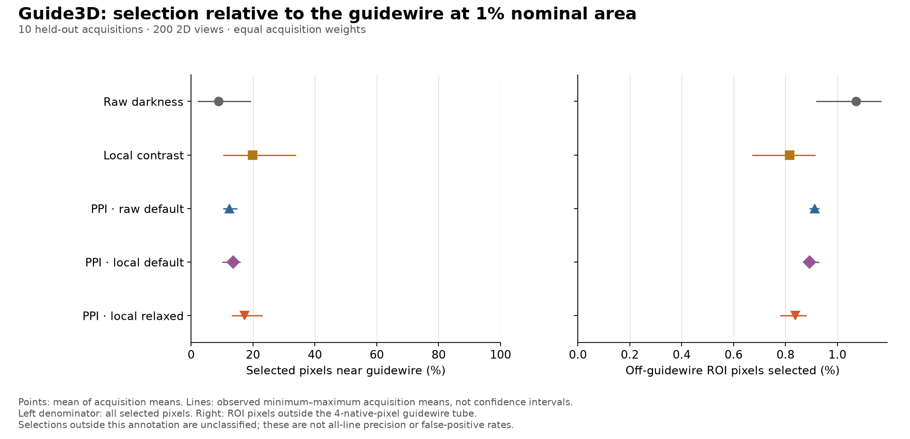
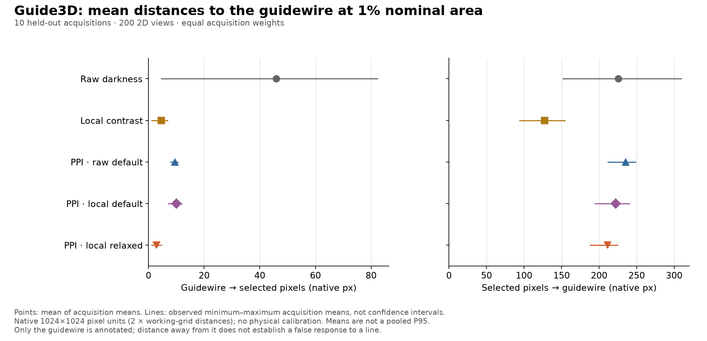

# Guide3D acquired-image pilot

PPI enhances line structures generally. This study applies the released PPI
computation API to acquired fluoroscopic images of a vascular phantom, where
Guide3D annotates the guidewire but not every visible line. It measures recovery
of that annotated guidewire and the spatial distribution of selected pixels.
Selections elsewhere are **unclassified for the general line-enhancement task**:
the annotations cannot establish whether they are other valid lines or unwanted
responses. This is not a complete evaluation of all-line detection precision.

The MICCAI 2012 clinical dataset was private and is unavailable for this study,
as confirmed by Laurent Najman. Guide3D provides a separate, reproducible phantom
experiment. The package implements a later four-cone PPI variant, and this study
uses full tip-and-shaft annotations. Neither the implementation nor this task
reproduces the clinical evaluation in that paper. See the
[scientific scope](../../validation.md).

The [executed notebook](../../../examples/ppi_guide3d_study.ipynb) reads the
[complete scalar results](results.json), following the [frozen protocol](protocol.json).
It does not download or redistribute
the underlying images. The results include the frozen protocol, all sampled
frame IDs, the acquisition split, development selection, per-view measurements,
image hashes, environment, source hashes and the complete dataset audit.

## Held-out results

At the predefined **1% nominal ROI-area budget**, development-selected local PPI
reaches **89.1% centerline coverage**, compared with **83.3% for direct local
contrast**, a gain of **5.9 percentage points**. Actual selected areas are very
close: **1.005% and 1.012%**. Of the selected pixels, **17.3% and 20.0%**,
respectively, lie near the annotated guidewire. These fractions describe
association with this one labeled structure. They do **not** show that PPI has
lower precision for enhancing all lines, because other lines are not labeled.
The coverage gain is established for the annotated guidewire; general line
selectivity remains unmeasured by this dataset.

Every number below is a mean of the ten acquisition means, each based on twenty
views. Coverage refers only to reference arclength inside the evaluation ROI.
The tolerance is four native pixels.

| Method | Guidewire coverage | Selected near guidewire | Off-guidewire rate | Actual selected area |
| --- | ---: | ---: | ---: | ---: |
| Raw darkness | 42.8% | 8.8% | 1.071% | 1.167% |
| Direct local contrast | 83.3% | 20.0% | 0.815% | 1.012% |
| Raw PPI, default | 68.8% | 12.4% | 0.913% | 1.035% |
| Local PPI, default | 69.8% | 13.6% | 0.893% | 1.027% |
| Local PPI, development-selected (`tau=0.5`) | 89.1% | 17.3% | 0.837% | 1.005% |

The selected setting improves coverage over direct local contrast in **eight of
10 acquisitions**. The two no-fluid/straight acquisitions favor local contrast
by 6.5 and 5.8 percentage points. The paired coverage difference ranges from
**−6.5 to +18.8 percentage points**. Selected-PPI acquisition coverage ranges
from 82.1% to 97.4%, versus 71.8% to 96.6% for local contrast. These are observed
ranges, not statistical confidence intervals.





Local-contrast preprocessing alone is a useful comparator: it exceeds both
default PPI variants in mean guidewire coverage and in the fraction selected
near that guidewire. Relaxing the tortuosity filter improves this pilot’s
guidewire recovery, but does not justify changing the package default from
this small study. The development scores were 69.7% for local PPI default,
87.0% for the relaxed setting and 56.2% for shorter paths.



Mean guidewire-to-selection distance is **2.85 native pixels** for selected PPI
and **4.57** for local contrast, consistent with fewer missed curve sections.
Mean selection-to-guidewire distance is **211.47 native pixels** for selected
PPI and **127.31** for local contrast. This describes where the selected pixels
lie relative to the guidewire; it does not identify them as clutter or erroneous
line responses. These are acquisition averages of per-view mean distances,
not distances pooled across all points.



The ROI retains **95.66%** of annotated arclength on average; acquisition means
range from **95.24% to 96.31%**. The excluded samples count as neither recovered
nor missed. There were no processing failures or view exclusions within the
frozen 260-view panel. The record contains 1,440 development measurements and
4,000 held-out measurements.
An independent aggregation reproduced the table and verified all 260 decoded
image hashes, all nine recorded source-file hashes and the compiled-kernel hash.

The [complete-reference multi-line study](../multiline/README.md) now tests
whether PPI recovers all generated lines, including weak lines near stronger
ones, while suppressing non-line background. Other visible lines in Guide3D
should not be treated as errors merely because its annotations omit them.
Changes guided by these results should receive a new independent evaluation;
repeatedly tuning against these same held-out acquisitions would turn them into
development data. The measured results, their stored metric keys and the frozen
protocol are preserved; this report corrects their interpretation for PPI's
general line-enhancement objective.

## Data audit

The source is **Guide3D**, by Tudor Jianu and colleagues:
[project](https://airvlab.github.io/guide3d/),
[paper](https://arxiv.org/abs/2410.22224),
[data collection](https://airvlab.github.io/guide3d/data_collection.html), and
[download](https://huggingface.co/datasets/airvlab/guide3d).
These are acquired X-ray images of a silicone vascular phantom, with angled and
straight guidewires, with and without fluid. They are not patient images.

| Audit item | Observed result |
| --- | ---: |
| Decoded images in the pinned archive | 8,742 |
| Image geometry and type | 1024 × 1024, grayscale uint8 |
| Images with manual 2D polylines | 8,200 |
| Annotated paired frames | 4,100 |
| Annotated acquisitions | 13 |
| Images missing from the archive | 0 |
| Out-of-bounds annotation coordinates | 0 |
| Exact duplicate images | 0 |
| Unannotated images, excluded | 542 |

The project page advertises 8,746 images. The pinned archive contains 8,742 PNGs
and four metadata files. Its unannotated acquisition, `0-bca-straight-4`, contains
542 PNGs. We use the measured image/annotation intersection, without imputing
labels or treating unannotated images as negatives.

There are 53 zero-length annotation segments in 45 polylines, and 505 repeated
polyline annotations beyond the first occurrence in 217 groups. All repeated
polylines are within acquisitions. They are preserved: a repeated annotation
does not imply an identical image. Sparse manual segments are evaluated directly;
we do not substitute reprojected 3D curves for manual 2D annotations. Visual checks
confirmed coordinate alignment in both cameras and each fluid/wire stratum.
The 260 sampled views contain no exact duplicate polylines.

Pinned sources:

- Image archive revision: `1234a083c1b85a6f0cb84fb15b6a68c86044d253`.
- Annotation repository revision: `e034a71ca5cce0f5c64d67f6fc5302ce98d64481`.
- Archive SHA-256: `90adb69e69ff8ec128130da33d390cd9b23c51e122d092229c549b1f33d3c236`.
- Manual `raw.json` SHA-256: `5b6fa440c15ca66da276fe3619cd9122e5ab8d2ca662768c737e141991abdfc3`.

## Frozen protocol

Ten paired frame positions are selected from each annotated acquisition by
rounding evenly spaced positions in its sorted frame list, including both ends.
Both cameras are retained, giving **260 views from 130 paired frames**.

| Split | Acquisitions | Paired frames | Views |
| --- | ---: | ---: | ---: |
| Development | 3 | 30 | 60 |
| Held-out evaluation | 10 | 100 | 200 |

Development acquisitions are `0-bca-angle-1`, `0-bca-straight-1` and
`1-bca-angle-1`. The other ten are held out. No frame or paired camera crosses
the acquisition split. Evaluation includes three no-fluid/angled acquisitions,
two no-fluid/straight, four fluid/angled, and one fluid/straight. The sole
fluid/straight acquisition cannot provide independent examples to both splits.

We average views within each acquisition, then average acquisitions with equal
weight. Thus the experimental units for reported variation are ten acquisitions,
not 200 independent images. The displayed acquisition ranges are descriptive,
not confidence intervals. Shared phantom, imaging setup and wires also limit
generalization beyond these acquisitions.
This study-specific split and its distance-based measurements are not directly
comparable to the Guide3D paper's segmentation benchmark.

### Image preparation and comparison methods

Images are reduced to 512 × 512 by averaging nonoverlapping 2 × 2 blocks and
rounding with `numpy.rint`. Native pixel-center coordinates transform as
`working = (native - 0.5) / 2`, after converting upstream `(x, y)` to
`(row, column)`. The scale is two native pixels per working pixel.

The field of view is the largest 4-connected component of working intensities
greater than 5, with holes filled. The evaluation region is its Euclidean inset
by more than 16 working pixels, including distance to image edges. These fixed,
image-only rules were checked on development images before computation. They
exclude black collimation borders without cropping around ground truth.
The inset does not eliminate every boundary effect: paths and Gaussian support
extend farther than 16 pixels, and paths beginning outside the ROI can vote
inside it. This is part of the frozen pipeline being evaluated.

The comparisons are:

1. **Darkness:** `255 - working_image`.
2. **Local contrast:** positive `Gaussian(image, sigma=8) - image`, with reflected
   Gaussian boundaries. Outside the FOV, the image is filled with the FOV median
   before filtering. Scale by the ROI's 99.5th percentile, floored at one gray
   level, clip to `[0, 1]`, multiply by 255 and round to uint8. Scores outside
   the FOV are zero.
3. **Raw PPI default:** package settings `L=3, K=10, tau=0.75`, using working
   intensities as costs and replacing costs outside the FOV with 255.
4. **Local PPI default:** the same package settings, using `255 - local_score`
   as costs. This is exactly the quantized score used by the local-contrast
   baseline, allowing the contribution of paths to be examined separately.
5. **Development-selected local PPI**, when different from the default.

Only three local PPI configurations are considered: default `(3,10,0.75)`,
relaxed tortuosity `(3,10,0.5)`, and shorter paths `(3,5,0.75)`. Selection
maximizes acquisition-macro centerline coverage on development views at the
nominal 1% budget. Exact ties favor lower actual selected area, then the fixed
configuration order above. The selected configuration is fixed before the
evaluation phase. This small development set supports a pilot choice, not a
new package default.

### Measurements and denominators

Requested selection budgets are **0.25%, 0.5%, 1% and 2% of ROI pixels**;
**1% is the primary comparison**. Only finite, positive scores can be selected.
The cutoff includes its entire tie block. Consequently, equal nominal budgets
do not ensure equal selected areas. In particular, local normalization saturates
approximately the top 0.5% of ROI pixels, so its nominal 0.25% selection overshoots.
Every comparison therefore shows actual selected area.

Centerline coverage is the arclength-weighted fraction of reference samples
within **two working pixels, or four native pixels**, of a selected pixel center.
Samples are spaced at most 0.25 working pixels apart along the original finite
polyline, with trapezoidal arclength weights. A sample belongs to the ROI if its
nearest pixel center belongs to the ROI. Retained reference length is the sum
of those weights, an approximation to geometric clipping; vertices are never
removed and rejoined across an excluded region.

The **fraction selected near the guidewire** is the fraction of selected ROI
pixel centers within that tolerance of its complete continuous manual polyline.
The **off-guidewire rate** is the number of selected ROI pixels farther than
the tolerance, divided by all ROI pixels farther than the tolerance. The JSON
retains the historical metric keys `selected_pixel_precision` and
`off_tube_false_positive_rate` for reproducibility. With these incomplete
all-line annotations, those keys measure association with the annotated
guidewire and selections outside its tolerance tube: they are **not general
line-detection precision or false-positive rates**. Coverage and the fraction
selected near the guidewire have different denominators and are not combined
into an F1 score.

Two directed mean and 95th-percentile distances describe recovery of the
annotated guidewire and distance of selected pixels from it. Distance away
from this annotation does not establish an error in general line enhancement.
They are untruncated Euclidean distances.
JSON stores working-pixel distances; figures and the notebook convert them to
native pixels. Exact finite-segment distances and an exact KD-tree query are
used; fixture tests compare the accelerated evaluator with the existing
synthetic evaluator.
An average of per-view P95 distances is not a pooled P95 across all points.

## Reproduce

Use a repository checkout; benchmark modules are research tooling, not installed
top-level package APIs. Keep the data directory outside the checkout. The archive
download is approximately 4.07 GB and extraction needs additional disk space.

```sh
python -m pip install '.[study,test]'
python -m benchmarks.guide3d_data --destination ../guide3d-data --extract --audit
python -m benchmarks.run_guide3d \
  --annotations ../guide3d-data/raw.json \
  --data-root ../guide3d-data/extracted/guide3d \
  --audit ../guide3d-data/audit.json \
  --work-dir ../guide3d-run \
  --output benchmark-output/guide3d-results.json \
  --workers 4
python -m benchmarks.plot_guide3d \
  --input benchmark-output/guide3d-results.json \
  --output benchmark-output/guide3d-figures
python -m pytest tests/test_guide3d*.py
```

An optional visual check renders the first paired development frame, with manual
polylines and selected-pixel overlays. Its figures contain licensed source image
content and are deliberately written outside the repository, with attribution
and modification notices:

```sh
python -m benchmarks.preview_guide3d \
  --annotations ../guide3d-data/raw.json \
  --data-root ../guide3d-data/extracted/guide3d \
  --output-dir ../guide3d-visual-check
```

These fixed development examples are not selected to represent held-out
performance. On both examples, all 18 metrics shared with the original synthetic
evaluator agree exactly; the preview command repeats this full-size differential
check for direct local-contrast selections.

The downloader verifies pinned hashes and archive integrity before safe
extraction. The runner writes a protocol fingerprint before any score computation
and checkpoints each view. Rerunning the same command resumes those checkpoints;
changed protocol, study source, implementation or compiled kernel requires a
new work directory. Sources and kernel are checked again at completion. Cached
views assume the audited input directory has remained unchanged; per-view decoded
image hashes are retained. Do not modify raw data between resumed runs.

`--phase prepare` writes only the frozen protocol; `--phase development` runs
the development panel without evaluation. The default phase runs development,
selects the configuration, then runs evaluation. Pipeline timings in the JSON
are observations under concurrent workers, not a controlled speed benchmark.
The recorded run used Python 3.11.5, NumPy 2.4.6 and SciPy 1.17.1 on macOS arm64.
Development and the first four evaluation views used four workers; the remaining
evaluation resumed from unchanged checkpoints with eight workers. The JSON's
`environment.workers` records the final invocation; cached timings span both
concurrency settings and other local activity. Scientific measurements are
independent of the worker count.

To inspect the committed scalar results without downloading images:

```sh
python -m pip install '.[benchmark,notebook]'
python -m nbconvert --execute --to notebook \
  --ExecutePreprocessor.timeout=180 \
  --output ppi_guide3d_study.executed.ipynb \
  --output-dir benchmark-output examples/ppi_guide3d_study.ipynb
```

## Interpretation and licensing

This is a two-dimensional ranking study relative to one annotated guidewire on
a small fixed subset of acquired phantom images. It does not measure precision
or false detections for all visible lines, clinical safety, 3D reconstruction,
temporal tracking, tip-only detection, or detection when no guidewire is present. The
same acquisition split must be respected in future development. Once these
evaluation results are inspected, changes informed by them require another
independent test set for an unbiased confirmatory claim.

The [complete-reference multi-line study](../multiline/README.md) separately
tests recovery of every generated line, including weak lines beside strong
ones, with development-frozen thresholds and blank/noise controls. Its
synthetic background selections have a complete declared reference, unlike
off-guidewire selections in this acquired-image pilot.

Guide3D is distributed under
[CC BY-NC 4.0](https://huggingface.co/datasets/airvlab/guide3d), independently of
the package's BSD-3-Clause code license. Dataset images and original polylines
remain outside this repository. Published notebook outputs and figures contain
derived scalar measurements only. Credit the Guide3D creators when using these
data: Tudor Jianu et al., *Guide3D: A Bi-planar X-ray Dataset for 3D Shape
Reconstruction*, ACCV 2024, [arXiv:2410.22224](https://arxiv.org/abs/2410.22224).
