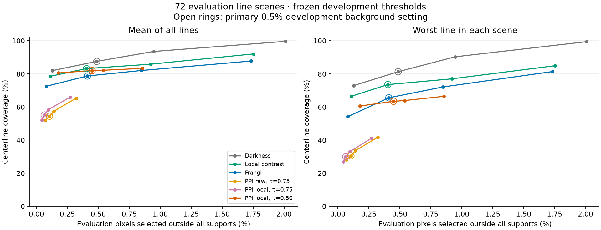
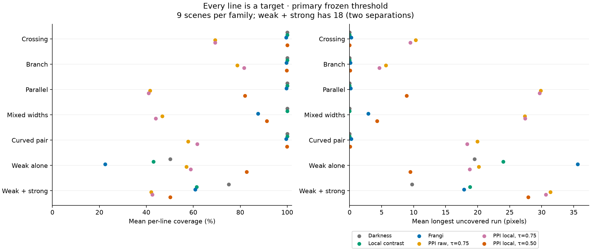
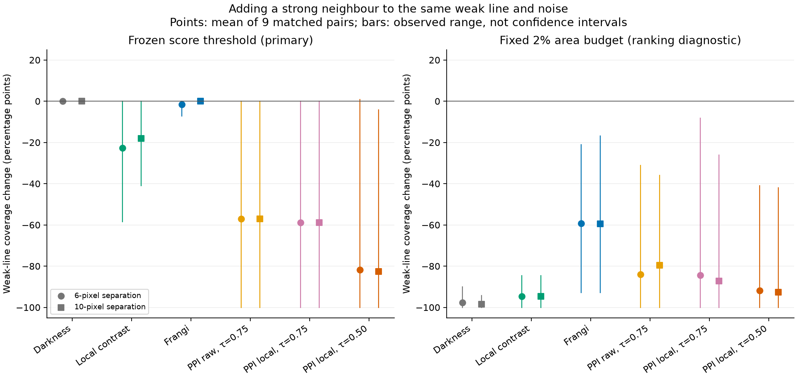
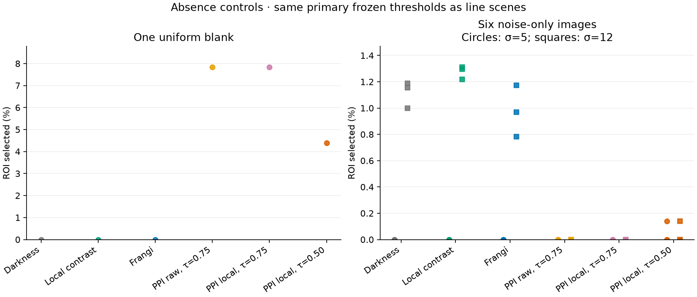
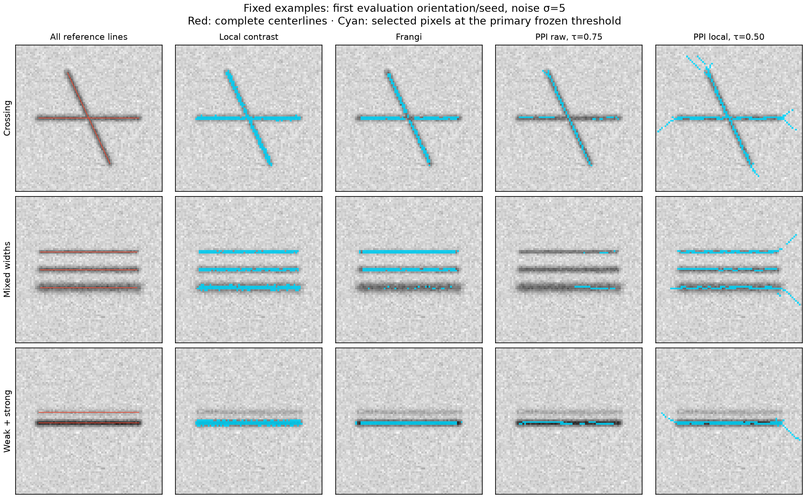

# Complete-reference multi-line study

PPI is intended to enhance curvilinear structures regardless of their semantic
identity. This study tests recovery of **every generated line**, including weak
lines beside strong ones. It uses the unchanged `0.1.0` implementation and
compares its votes with image darkness, local contrast and Frangi vesselness.
No method parameters were selected from these evaluation results.

The [Guide3D pilot](../guide3d/README.md) answers a narrower question: recovery
of its annotated guidewire. Other visible lines are unclassified there, so
off-guidewire selections cannot establish false detections for general line
enhancement. Here all intended structures have references, and the clean
synthetic image is exactly constant outside their declared supports.

The [executed notebook](../../../examples/ppi_multiline_study.ipynb),
[frozen protocol](protocol.json) and [complete measurements](results.json)
provide the runnable analysis and its provenance. This is a synthetic stress
test, not clinical validation, an exact MICCAI 2012 reproduction, or proof that
PPI finds every possible line appearance.

## Results

The main finding is **loss of weak-line recovery when a strong neighbour is
present**, even with a fixed score threshold. The default PPI configurations
also recover only about 55% of reference arclength on average across this
panel. Relaxing tortuosity improves overall recovery substantially, but does
not resolve the paired weak-line failure or blank-image response.

At the primary threshold, calibrated to at most 0.5% **pooled development**
background selection:

| Method | Mean coverage | Worst-line coverage | Evaluation outside-support selection | Mean longest gap (pixels) |
| --- | ---: | ---: | ---: | ---: |
| Darkness | 87.6% | 81.3% | 0.487% | 4.88 |
| Local contrast | 83.2% | 73.6% | 0.404% | 7.70 |
| Frangi | 78.7% | 65.6% | 0.412% | 9.38 |
| PPI raw, τ = 0.75 | 54.4% | 30.5% | 0.106% | 22.01 |
| PPI local, τ = 0.75 | 55.2% | 30.0% | 0.063% | 21.21 |
| PPI local, τ = 0.50 | 82.0% | 63.5% | 0.451% | 9.82 |

All four columns average the same 72 evaluation line scenes. The default PPI
thresholds transfer more conservatively to evaluation, selecting much less
background than the other methods. Thus these are **not comparisons at
identical evaluation background rates**. The curves below show all declared
operating points, and the numerical rankings apply only to this panel and
these settings. No confidence intervals or significance claims are made.

The primary numerical cutoffs are 27 (darkness), 53 (local contrast),
0.8458677115379657 (Frangi), 56 (both default PPI variants) and 58 (relaxed
local PPI), always with strict `score > cutoff`. Actual pooled development
rates are respectively 0.457%, 0.457%, 0.499%, 0.444%, 0.448% and 0.492%.



Each point uses a threshold frozen from development data. The x coordinate is
the **observed evaluation** selection rate outside every line's support, not
the requested development rate. Open rings identify the primary operating
point. Lines join four fixed thresholds; no evaluation labels were used to
choose or interpolate thresholds. Similar calibration targets do not imply
exactly matched evaluation background rates.

The run completed all 100 scenes without exclusions, producing 4,200
method/operating-point measurements and 600 score maps. An independent audit
verified every score-map hash and recomputed all 24 thresholds from the full
development background population. Ninety primary rows were remeasured using
an independent nearest-point calculation; the largest numeric difference was
9.24 × 10⁻¹⁴. Separate tests cover union geometry, line pairing, calibration,
missing selections and figure limits.



The second panel measures the longest uncovered run on each reference, then
averages lines and scenes. Smaller is better. This is a sampled arclength
diagnostic; it does not establish graph connectivity or correct branch identity.

## Weak lines beside strong lines

Every weak-alone scene has two matched variants with a stronger parallel line
6 or 10 pixels away. Weak geometry, noise and input pixels within two pixels
of the weak centerline are identical across the three images. The same
weak-alone case is reused for the two comparisons; they are not independent.

At the primary frozen threshold, mean weak-line coverage over nine matched
evaluation contexts is:

| Method | Weak alone | Strong neighbour, gap 6 | Strong neighbour, gap 10 |
| --- | ---: | ---: | ---: |
| Darkness | 50.2% | 50.2% | 50.2% |
| Local contrast | 43.0% | 20.4% | 25.0% |
| Frangi | 22.4% | 20.9% | 22.4% |
| PPI raw, τ = 0.75 | 57.1% | 0.0% | 0.0% |
| PPI local, τ = 0.75 | 58.9% | 0.0% | 0.0% |
| PPI local, τ = 0.50 | 82.7% | 0.8% | 0.0% |

For default raw PPI, the weak line has no selected pixel within the two-pixel
coverage tolerance in any of the 18 paired strong-neighbour scenes at this
threshold. The unchanged darkness result verifies that the weak-band intensity
evidence is preserved. These observations demonstrate a failure of the
evaluated PPI pipeline to recover all lines at this operating point. They do
not yet locate the cause in path selection, tortuosity rejection or voting.



The frozen-threshold comparison uses the same numerical score cutoff before
and after the neighbour is added. The area-budget comparison is a separate
ranking diagnostic: an extra strong line competes for a fixed amount of
selected image area. A loss under that budget alone does not prove suppression
by the path algorithm. Local contrast preprocessing can also alter the weak
response despite unchanged nearby pixels, because its Gaussian neighbourhood
includes the strong line. Darkness and direct local contrast help separate
these effects from the whole PPI pipeline; the experiment does not isolate
every internal cause.

## Blank and noise-only controls

On the uniform blank, both default PPI variants select **502 / 6,400 pixels
(7.84%)**, and relaxed local PPI selects **281 pixels (4.39%)**. Darkness, local
contrast and Frangi select none. The default PPI variants select no pixels
on any of the six noise-only controls; relaxed local PPI selects 9 pixels on
two controls (0.14%) and zero on the other four. The direct baselines select
zero at noise 5 and between 0.78% and 1.31% at noise 12.

The high blank response is compatible with the pooled calibration rule: its
0.5% target bounds the combined development background population, not every
individual image. The blank is only one member of that population. PPI votes
therefore do not by themselves provide a reliable line-presence confidence.



All pixels in these controls are background. They use the same frozen scalar
thresholds as line scenes, without a forced selection quota. A nonzero result
therefore measures background response at that operating point. The one blank
per split is an intentionally repeated deterministic control, not two
independent observations. Six evaluation noise controls use three seeds at
two noise levels; different levels reuse the same underlying Gaussian draws.

## Fixed visual examples



These examples were fixed as the first evaluation orientation/seed (0°, seed
2001, noise standard deviation 5), for crossing, mixed-width and 6-pixel
weak/strong scenes. They were not selected for favourable or unfavourable
results. Red marks all reference centerlines in the first column; cyan marks
selected pixels in the method columns. The images are cropped for display
only; processing uses the whole image and measurement uses the fixed ROI.

## Frozen design

The full panel has **100 images**: 21 development images (16 with lines and 5
controls) and 79 evaluation images (72 with lines and 7 controls). Every image
is 128 × 128 `uint8`; the fixed central 80 × 80 region is evaluated. All finite
line supports fit inside this region. Image-edge influences are not completely
excluded: PPI paths and the local Gaussian support exceed the 24-pixel ROI inset.

Each context contains eight scene variants:

| Family | Complete references |
| --- | --- |
| Crossing | Two 56-pixel lines crossing at 65° |
| Branch | Three separate 28-pixel arms meeting at one junction |
| Parallel | Three 56-pixel lines, 8 pixels apart |
| Mixed width | Three 54-pixel lines, 10 pixels apart; σ = 0.8, 1.25, 2 |
| Curved pair | Two 54-pixel arcs, each turning 70° |
| Weak alone | One 56-pixel line, contrast 20 |
| Weak + strong, gap 6 | Same weak line plus contrast-80 line, 6 pixels away |
| Weak + strong, gap 10 | Same weak line plus contrast-80 line, 10 pixels away |

Other lines have contrast 50 and σ = 1.25 pixels. A line's noiseless darkness
is `contrast * exp(-distance² / (2σ²))` within its finite 3σ tube and zero
outside. Distance is to each independent finite polyline; disconnected lines
are never concatenated. At overlaps the maximum darkness wins, avoiding
artificially dark additive intersections. Thus overlapping references can
have shared visible support; the benchmark does not require identity recovery
at their junction. The abrupt truncation removes a tail of approximately
1.1% of peak contrast, a modelling limitation.

Background is 200. Independent Gaussian pixel noise is added before rounding
and clipping to `[0,255]`; stated noise levels refer to the preclip standard
deviation. Curves are represented by polylines with reference vertices spaced
at most 0.25 pixels apart. All intended lines are dark; bright lines, texture,
uneven illumination, occlusion and naturally acquired images are outside this
first panel.

Development uses orientation 13° with seed 1001/noise 5 and seed 1002/noise 12.
Evaluation uses orientations 0°, 37°, 79° crossed with seeds 2001–2003. Noise
5 or 12 is assigned by parity of the orientation and seed indices. This gives
nine evaluation contexts, each with all eight variants. Both noise levels
occur for every orientation and seed, but this is not a full factorial.
There are only three underlying evaluation Gaussian noise draws, reused across
orientations, scene variants and noise scaling. The 72 scenes are not 72
independent statistical replicates. Development and evaluation use the same
families, with different orientations and noise seeds; this is not a test of
unseen scene families.

## Methods

| Method | Fixed configuration |
| --- | --- |
| Darkness | `max(200 - image, 0)`; knows the generator's true constant background |
| Local contrast | `rint(clip(2 * max(Gaussian(image, σ=8) - image, 0), 0, 255))`; reflect boundary mode, fixed gain |
| Frangi | scikit-image 0.25.2 on `image / 255`; scales 0.8, 1.25, 2; β = 0.5, γ = 0.02, dark ridges, reflect mode |
| PPI raw, τ = 0.75 | Original image as potential; segment length 3, 10 segments, default tortuosity threshold |
| PPI local, τ = 0.75 | `255 - local_contrast` as potential; otherwise the same PPI settings |
| PPI local, τ = 0.50 | Same local potential and paths, relaxed tortuosity threshold |

PPI scores are unweighted path votes with `border=0`. The local baseline and
local PPI share exactly the same quantized input signal. Neither local contrast
nor Frangi uses per-image maximum normalization. Frangi's fixed γ makes its
absolute scores comparable across images; α = 0.5 is passed but unused in 2D.
Its selected scales match the simulated widths, and darkness knows the true
background: both have useful prior information. These are declared baselines,
not exhaustively tuned competitors or a universal ranking. The Frangi API and
parameters are documented by
[scikit-image](https://scikit-image.org/docs/0.25.x/api/skimage.filters.html#skimage.filters.frangi).

## Thresholds and measurements

For each method, pool **all development ROI pixels outside the union of all
3σ supports**, including controls. At requested background fractions 0.1%,
0.5%, 1% and 2%, choose an observed score cutoff such that strict exceedances
number at most `floor(fraction * background_pixels)`. The cutoff is at least
zero. Select scores strictly greater than it; ties are never split arbitrarily.
Thresholds are written to disk before evaluation images are processed. Only
thresholds are calibrated; method parameters are fixed in advance. Primary
comparisons use the 0.5% development target.

The calibration population weights background pixels, while reported recovery
weights lines and scenes. Controls and different support sizes affect the
pooled calibration. The evaluation mixture differs from development, and
observed evaluation background rates are reported instead of assuming the
calibration target transfers exactly.

Secondary ranking measurements use nominal 1%, 2% and 5% ROI area budgets,
selecting finite positive scores with the entire cutoff tie block. Actual
selected fractions are retained because ties can overshoot. These relative
quotas are not used to judge absence of lines.

| Metric | Definition |
| --- | --- |
| Per-line coverage | Trapezoid-weighted fraction of each reference within 2 pixels of a selected pixel center; samples spaced at most 0.25 pixels in arclength |
| Mean coverage | Equal-line mean within each scene, then equal-scene mean across the 72 evaluation line scenes |
| Worst-line coverage | Minimum line coverage in each scene, then equal-scene mean |
| Longest uncovered run | Largest sum of sample quadrature weights in a consecutive uncovered run, separately for each reference; reported in pixels |
| Outside-support selection | Selected ROI pixel centers outside every line's own 3σ tube, divided by all ROI pixels outside that union |
| Support precision | Fraction of selected pixel centers inside at least one declared support |
| Centerline precision | Fraction of selected pixel centers within 2 pixels of at least one finite reference |
| Localization | Selected pixels → nearest finite reference and each reference → nearest selected pixel, with means and 95th percentiles retained separately |

Crossings count toward each incident reference's coverage, but only once in
pixel counts. A line's width affects the support mask, so valid responses in
a wide tube are not counted as background merely for being more than two
pixels from its centerline. Reference and pixel populations differ; no F1 score
combines them. With no selections, line coverage is zero and localization is
undefined. With no lines, geometric coverage/centerline precision are null;
all selected pixels are background, and support precision is zero when there
are selections. Distances use exact finite-segment geometry and exact nearest
selected-pixel queries; continuity remains a sampled approximation.

Precision and distance summaries omit undefined no-selection scenes instead
of replacing them with zero. At the primary operating point, their available
scene counts are 71/72 for darkness, 70/72 for local contrast, 68/72 for Frangi,
67/72 for raw PPI, 68/72 for default local PPI and 72/72 for relaxed local PPI.
Coverage and uncovered-run measurements still include every line scene, giving
missed lines zero coverage and their full length as the uncovered run.

## Reproduce and inspect

From a repository checkout:

```sh
python -m pip install -e '.[study,notebook,test]'
python -m pytest tests/test_multiline*.py
python -m benchmarks.run_multiline --suite full --workers 4 \
  --work-dir benchmark-output/multiline \
  --output benchmark-output/multiline-results.json
python -m benchmarks.plot_multiline \
  --input benchmark-output/multiline-results.json \
  --cache-dir benchmark-output/multiline/cache \
  --output-dir benchmark-output/multiline-figures
python -m jupyterlab examples/ppi_multiline_study.ipynb
```

Use `--suite smoke` for ten scenes with calibration/evaluation weak-line pairs
and controls. `--phase prepare` writes the protocol without scoring images;
`--phase development` stops after calibration and development measurements.
The runner checkpoints each score map and verifies cache checksums. A work
directory is bound to protocol, source hashes, Git revision and library
versions: use a new directory after any of these change. Processing and
measurement sources are checked again before final results are written.

The recorded result includes image, polyline and score hashes; exact source
and compiled-kernel hashes; versions; every per-line measurement; and observed
pipeline timings. Concurrent execution and cache reuse make those timings
unsuitable for a controlled speed comparison. Raw synthetic score maps are
regenerable and remain outside the committed report. No external dataset or
additional image license is required.

The recorded full run used Python 3.11.5, NumPy 2.4.6, SciPy 1.17.1 and
scikit-image 0.25.2 on macOS arm64, with four workers. Exact versions and source
hashes are included in both the protocol wrapper and result JSON.

## Consequences for development

The immediate algorithmic priorities are **weak-line preservation** and a
meaningful response on images without lines. Changing tortuosity alone helped
average coverage but left these failures. A useful next experiment would trace
which paths leave the weak line for its neighbour, which survive tortuosity
filtering, and how their votes accumulate. That is a hypothesis to investigate,
not a cause established by this benchmark.

Any resulting implementation change should preserve these examples as
regression cases and be assessed on new, predeclared geometries and noise
draws. This evaluation panel has now informed our conclusions; repeatedly
tuning against it would turn it into development data. Package code and
defaults remain unchanged by the study.

Real-image validation will need a small image set with every relevant line
reviewed and annotated. Guidewire-only annotations remain useful for measuring
that guidewire's recovery, while semantic selection of one object is a
separate downstream task.
