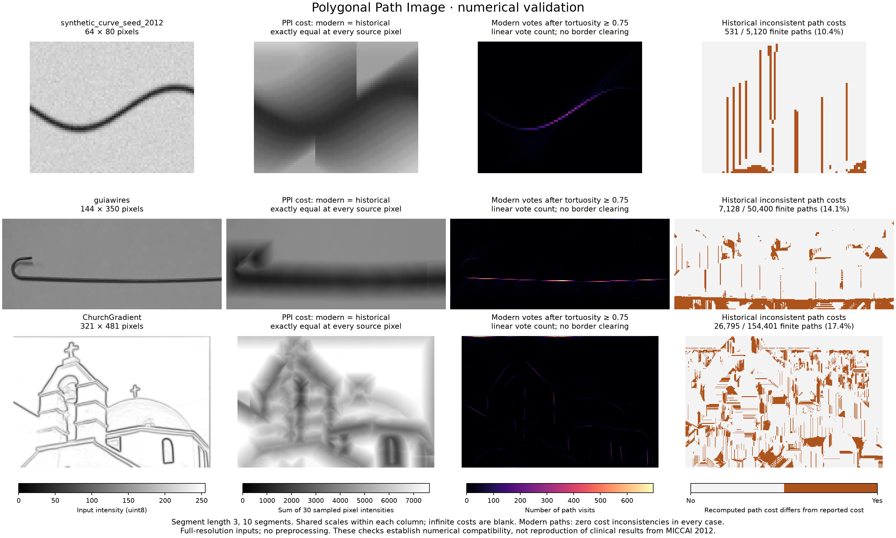

# Validation and scientific scope

Version 0.1.0 implements the discrete, four-cone variant in the historical
`FinalVersion` code by Paula Agregán Reboredo, Vincent Bismuth, and Laurent Najman.
It preserves the historical minimum costs, repairs path reconstruction, and
defines array-based postprocessing. The checks below validate those computations;
they do not reproduce the MICCAI 2012 clinical evaluation.

## Full-image numerical checks

Validation date: 25 September 2026. Every image was processed at its original
resolution as `uint8`, without rescaling or preprocessing, with
`segment_length=3`, `nb_segments=10`, and tortuosity threshold `0.75`.

| Input | Shape (rows × columns) | Finite paths checked | Cost differences from FinalVersion | Historical path-cost inconsistencies | Package path-cost inconsistencies |
| --- | --- | ---: | ---: | ---: | ---: |
| Synthetic dark curve, seed 2012 | 64 × 80 | 5,120 | 0 | 531 | 0 |
| `guiawires.pgm` | 144 × 350 | 50,400 | 0 | 7,128 | 0 |
| `ChurchGradient.pgm` | 321 × 481 | 154,401 | 0 | 26,795 | 0 |

All **209,921** reconstructed package paths have valid endpoints, lie within
one admissible cone, and have the reported raster cost. An independent integer
midpoint formula rasterizes each segment for this audit; it does not call the
production Bresenham implementation. The package's voting arrays also match
independent accumulation over these pixels exactly.

Historical path-cost inconsistencies mean that a returned path's pixels do not
sum to its reported cost. The immutable dynamic-programming backpointers fix
this while preserving the minimum cost arrays. Agreement with historical costs
is a compatibility result, not an independent proof of optimality. The test
suite separately enumerates all admissible paths on small images to check
optimality, ties, and reconstruction.

For postprocessing comparisons, we fed **identical corrected paths** into both
implementations. The historical voting output equals package voting with
`border=2`. Including the previously omitted first turn in tortuosity rejects
231 additional synthetic paths, 1,918 additional `guiawires` paths, and 7,663
additional `ChurchGradient` paths. No path is retained only by the corrected
tortuosity implementation in these three cases. Orientation and pruning have
different documented definitions and are covered by focused tests rather than
claimed numerical equivalence to the historical plotting routines.

The [machine-readable record](validation-results.json) contains input hashes,
source and compiled-kernel hashes, environments, parameters, timing and memory
observations, comparison metrics, and examples of historical inconsistencies.
Large intermediate arrays and worker logs remain local; artifact filenames in
the record identify files recreated by the validation script. The supplied
historical `.npy` vote maps were not used as expected outputs because their
generation parameters are unknown.



Shared scales within each column make the three examples comparable. No
clinical segmentation accuracy is inferred from these visualizations.

## Relationship to the paper

The reference is [Bismuth, Vaillant, Talbot, and Najman, MICCAI 2012](https://hal.science/hal-00741956v1/),
DOI [10.1007/978-3-642-33418-4_2](https://doi.org/10.1007/978-3-642-33418-4_2).
Paula's supplied project thesis, `FinalVersion/PFC_paris.pdf`, explains choices
made in the later student implementation. The table separates inherited
conventions from changes introduced by this package.

| Topic | Package convention and relationship to the sources |
| --- | --- |
| Search directions | Four fixed cardinal 90° cones, inherited from FinalVersion. The thesis (printed p. 23) distinguishes these from the original eight overlapping cones. The paper itself does not specify a cone count. |
| Segment geometry | Constant main-axis displacement, with endpoints on square sides and Bresenham rasterization. Euclidean segment lengths range from `l` to `sqrt(2)*l`; `K*l` is a raster-step count, not necessarily Euclidean arclength. This is inherited discretization. |
| Potential | Nonnegative `uint8` input, with low values preferred. The package does not perform the paper's clinical preprocessing automatically. |
| Cost | Counts segment ends and shared joints once, omitting the whole path's source. This inherited convention differs from the all-pixel sum in paper Eq. (1). |
| Reconstruction | Immutable layer-specific backpointers repair the historical coordinate overwrite. Per-source minima and historical tie order are preserved. |
| Voting | Unweighted voting corresponds to Eq. (3) for these non-self-intersecting computed paths. Weighted voting from Eq. (4) is absent. Border clearing is explicit instead of unconditional. |
| Tortuosity | Product of all adjacent-segment turn cosines, following the thesis's normalized metric (printed p. 26). Includes the first turn, rejects zero-length segments, and retains threshold equality within numerical tolerance. Paper Eq. (6) uses a strict threshold. |
| Orientation | Dense axial double-angle mean, weighted by squared segment length. It repairs and redesigns the sparse plotting estimator; equivalence to the paper's unit-tangent description is not established. |
| Pruning | Deterministic greedy selection with a directed endpoint-fraction proximity test. It removes the historical source-window restriction; equivalence to a symmetric or full-raster partial Hausdorff test is not established. |

For the monotone paths returned by `compute_ppi`, adding the source potential
recovers the all-pixel cost without changing the minimizing path at each source:

```python
paper_pixel_costs = costs + image.astype(float)
```

This matters when comparing different source pixels, including greedy pruning.
For example, on `[[100, 1, 10]]` with one segment of length one, package costs
are `[[1, 10, 1]]`, whereas all-pixel costs are `[[101, 11, 11]]`. With pruning
distance five, the first convention selects source `(0, 0)` and the second
selects `(0, 1)`. A reproducibility protocol should specify its convention.

The paper's evaluation uses 108 clinical frames, centerline annotations,
preprocessing, and ROC-based metrics. That corpus was private and is unavailable
for this validation, as confirmed by Laurent Najman. These two example images
therefore support regression testing, not claims about clinical accuracy or
reproduction of the published results.

## Reproduce the checks

From a checkout or extracted source distribution:

```sh
python -m pip install '.[dev,examples]'
python -m pytest
python scripts/validate_research.py --output work/validation.json
```

The last command always includes the deterministic synthetic case. Add the two
original local files, if available, to reproduce the full-image checks:

```sh
python scripts/validate_research.py \
  --image /path/to/FinalVersion/guiawires.pgm \
  --image /path/to/FinalVersion/ChurchGradient.pgm \
  --output work/validation.json
```

The script rejects non-grayscale or non-`uint8` files instead of silently
converting them. It saves NumPy arrays, subprocess logs, and JSON, and exits
unsuccessfully if modern correctness checks fail. It includes optional
`--legacy-python /path/to/python` and `--legacy-module-dir /path/to/module`
arguments for a separately compiled historical `PPIpython` module.

The comparison here compiled an independent copy of the archived FinalVersion
source with Cython language level 2, replacing obsolete Python-level `np.int`
and `np.float` aliases and casting the unused pruning routine's loop bound to
an integer. These compatibility edits did not change the exercised algorithms.
The JSON records the exact compatibility-source hash and transformations.
Original source files and input images were not modified.

To regenerate the comparison figure after a run with the legacy worker:

```sh
python scripts/plot_validation.py work/validation.json \
  --output work/validation-comparison.png
```

Both workers used Python 3.11.5 on Apple Silicon/macOS 14.6; the package used
NumPy 2.4.6 and the legacy worker used NumPy 1.26.4. Timing values are single
observations with different dependency environments, not a controlled speedup
benchmark. Peak resident memory covers the worker lifetime, including imports,
auditing, and postprocessing; the script normalizes the operating system's
units rather than treating macOS bytes as Linux KiB.
